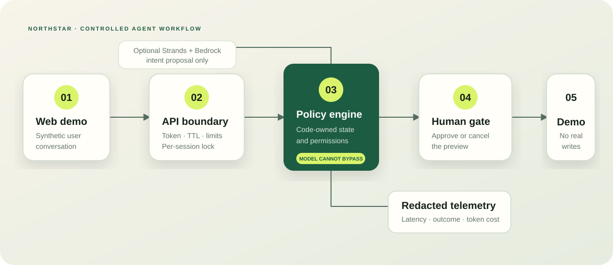

# Northstar — Conversational Banking Agent Demo



Northstar is a portfolio-ready, production-style demonstration of conversational banking with a human approval gate. It was created as a clean, neutral derivative of a vendor-specific AWS Strands prototype: the useful interaction pattern remains, while credentials, proprietary endpoints, mandatory KYC, customer-like data, and real external writes do not.

> **Synthetic demo:** no real bank, customer, authentication, account, or transaction is connected.

## What this demonstrates

| Capability | Evidence in the repository |
|---|---|
| Agentic workflow | Conversation → intent → deterministic policy → response |
| Human-in-the-loop | Transfer simulation creates a preview that must be approved or cancelled |
| AWS Strands / Bedrock | Optional, wired tool-free intent classifier when `DEMO_MODE=bedrock` |
| Security boundary | Session token, explicit CORS origin, request/turn/session limits, per-session lock |
| Observability | Redacted latency/model/token/cost trace schema |
| Portfolio UX | Interactive web demo plus a live system/control view |
| Engineering quality | Automated tests, CI workflow, architecture decisions and security policy |

## Safe architecture

The LLM is deliberately outside the authorization boundary. Even when Bedrock is enabled, it can propose one of five allowlisted intents; deterministic Python code decides what is permitted. A simulated transfer remains a preview until the user sends `approve`, and approval records only a synthetic reference.

## Run locally for free

Requires Python 3.11+.

```bash
python -m app.api
```

In a second terminal:

```bash
python -m http.server 8080 --directory web
```

Open `http://127.0.0.1:8080` and try:

- `Show my balance`
- `Recent transactions`
- `Spending summary`
- `Transfer $25 to Alex Demo`

## Test

```bash
python -m pytest -q
```

The core tests require only `pytest`; the default demo does not require Strands, boto3, or AWS credentials.

## Optional AWS Strands mode

Install the requirements, authenticate through an AWS profile or workload role, and set:

```bash
export DEMO_MODE=bedrock
export AWS_REGION=us-east-1
export BEDROCK_MODEL_ID=amazon.nova-pro-v1:0
```

Testing this optional path requires the reviewer's own AWS credentials and
Bedrock access. The repository contains no API keys or reusable credentials.
The UI uses the deterministic router by default; setting `DEMO_MODE=bedrock`
wires the bounded Strands classifier into the same workflow without granting
the model tool or write authority.

## Guardrails

- Synthetic fixtures only; no KYC data collection.
- No real transfer, payment, card, or customer-creation integration.
- No secrets in example configuration.
- No prompt or message body in telemetry.
- Maximum request, message, session, and turn budgets.
- Opaque session token and constant-time token comparison.
- Exact-origin CORS and loopback-only development server.
- Stable public errors without exception details.

## Portfolio talking points

1. **Why not let the agent call a transfer tool?** Because an LLM is probabilistic and prompt-injectable. It may propose an action, but code validates state, amount, authority, and approval.
2. **Why mock-first?** Recruiters can run it without accounts or cost, while the optional adapter still demonstrates AWS Strands/Bedrock integration design.
3. **What would production add?** Identity-provider authentication, durable encrypted session storage, a bank API gateway, signed idempotency keys, policy-as-code, distributed rate limiting, OpenTelemetry, KMS, private networking, and formal model/tool evaluations.

See [architecture decisions](docs/DECISIONS.md) and the [security policy](SECURITY.md).

## Usage and copyright

Portfolio review only. No open-source license is granted. See [COPYRIGHT.md](COPYRIGHT.md).
